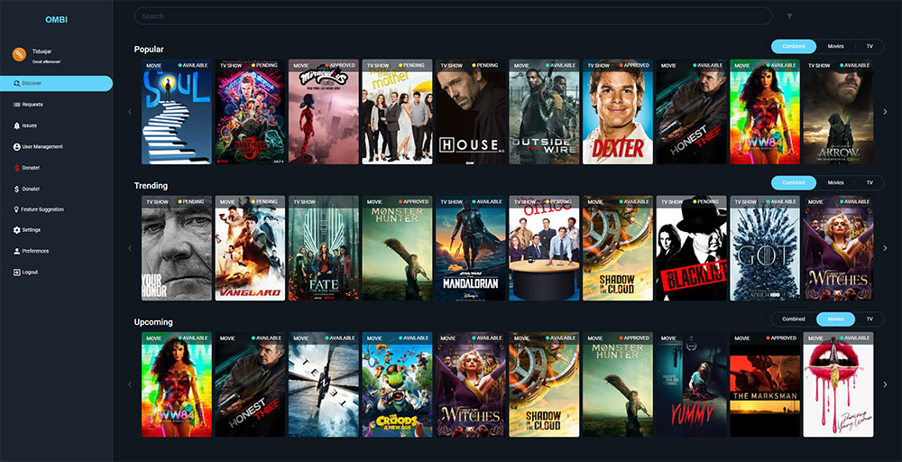

<!--
N.B.: README ini dibuat secara otomatis oleh <https://github.com/YunoHost/apps/tree/master/tools/readme_generator>
Ini TIDAK boleh diedit dengan tangan.
-->

# Ombi untuk YunoHost

[](https://ci-apps.yunohost.org/ci/apps/ombi/)  

[](https://install-app.yunohost.org/?app=ombi)

*[Baca README ini dengan bahasa yang lain.](./ALL_README.md)*

> *Paket ini memperbolehkan Anda untuk memasang Ombi secara cepat dan mudah pada server YunoHost.*  
> *Bila Anda tidak mempunyai YunoHost, silakan berkonsultasi dengan [panduan](https://yunohost.org/install) untuk mempelajari bagaimana untuk memasangnya.*

## Ringkasan

Ombi is a self-hosted web application that automatically gives your shared Plex or Emby users the ability to request content by themselves! Ombi can be linked to multiple TV Show and Movie DVR tools to create a seamless end-to-end experience for your users.


**Versi terkirim:** 4.44.1~ynh1

**Demo:** <https://app.ombi.io/landingpage>

## Tangkapan Layar



## Dokumentasi dan sumber daya

- Website aplikasi resmi: <https://ombi.io/>
- Dokumentasi admin resmi: <https://docs.ombi.app/guides/installation/>
- Repositori kode aplikasi hulu: <https://github.com/Ombi-app/Ombi>
- Gudang YunoHost: <https://apps.yunohost.org/app/ombi>
- Laporkan bug: <https://github.com/YunoHost-Apps/ombi_ynh/issues>

## Info developer

Silakan kirim pull request ke [`testing` branch](https://github.com/YunoHost-Apps/ombi_ynh/tree/testing).

Untuk mencoba branch `testing`, silakan dilanjutkan seperti:

```bash
sudo yunohost app install https://github.com/YunoHost-Apps/ombi_ynh/tree/testing --debug
atau
sudo yunohost app upgrade ombi -u https://github.com/YunoHost-Apps/ombi_ynh/tree/testing --debug
```

**Info lebih lanjut mengenai pemaketan aplikasi:** <https://yunohost.org/packaging_apps>
