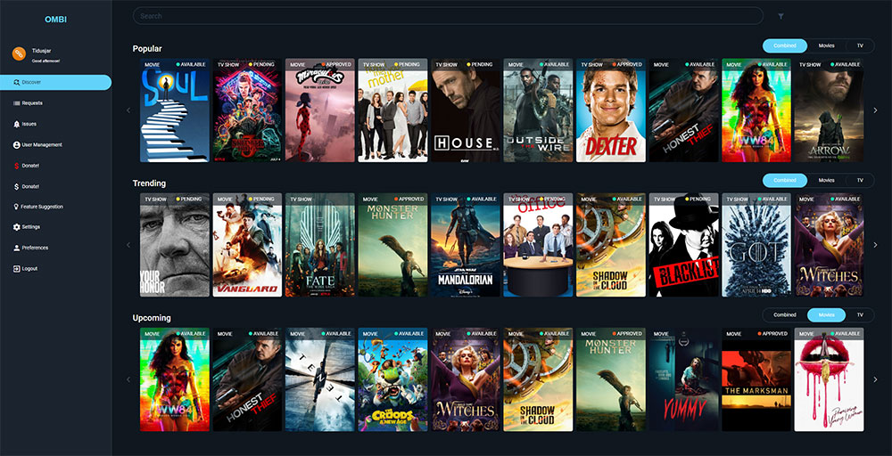

<!--
Важно: этот README был автоматически сгенерирован <https://github.com/YunoHost/apps/tree/master/tools/readme_generator>
Он НЕ ДОЛЖЕН редактироваться вручную.
-->

# Ombi для YunoHost

[](https://ci-apps.yunohost.org/ci/apps/ombi/)


[](https://install-app.yunohost.org/?app=ombi)

*[Прочтите этот README на других языках.](./ALL_README.md)*

> *Этот пакет позволяет Вам установить Ombi быстро и просто на YunoHost-сервер.*  
> *Если у Вас нет YunoHost, пожалуйста, посмотрите [инструкцию](https://yunohost.org/install), чтобы узнать, как установить его.*

## Обзор

Ombi is a self-hosted web application that automatically gives your shared Plex or Emby users the ability to request content by themselves! Ombi can be linked to multiple TV Show and Movie DVR tools to create a seamless end-to-end experience for your users.


**Поставляемая версия:** 4.47.1~ynh2

**Демо-версия:** <https://app.ombi.io/landingpage>

## Снимки экрана



## Документация и ресурсы

- Официальный веб-сайт приложения: <https://ombi.io/>
- Официальная документация администратора: <https://docs.ombi.app/guides/installation/>
- Репозиторий кода главной ветки приложения: <https://github.com/Ombi-app/Ombi>
- Магазин YunoHost: <https://apps.yunohost.org/app/ombi>
- Сообщите об ошибке: <https://github.com/YunoHost-Apps/ombi_ynh/issues>

## Информация для разработчиков

Пришлите Ваш запрос на слияние в [ветку `testing`](https://github.com/YunoHost-Apps/ombi_ynh/tree/testing).

Чтобы попробовать ветку `testing`, пожалуйста, сделайте что-то вроде этого:

```bash
sudo yunohost app install https://github.com/YunoHost-Apps/ombi_ynh/tree/testing --debug
или
sudo yunohost app upgrade ombi -u https://github.com/YunoHost-Apps/ombi_ynh/tree/testing --debug
```

**Больше информации о пакетировании приложений:** <https://yunohost.org/packaging_apps>
